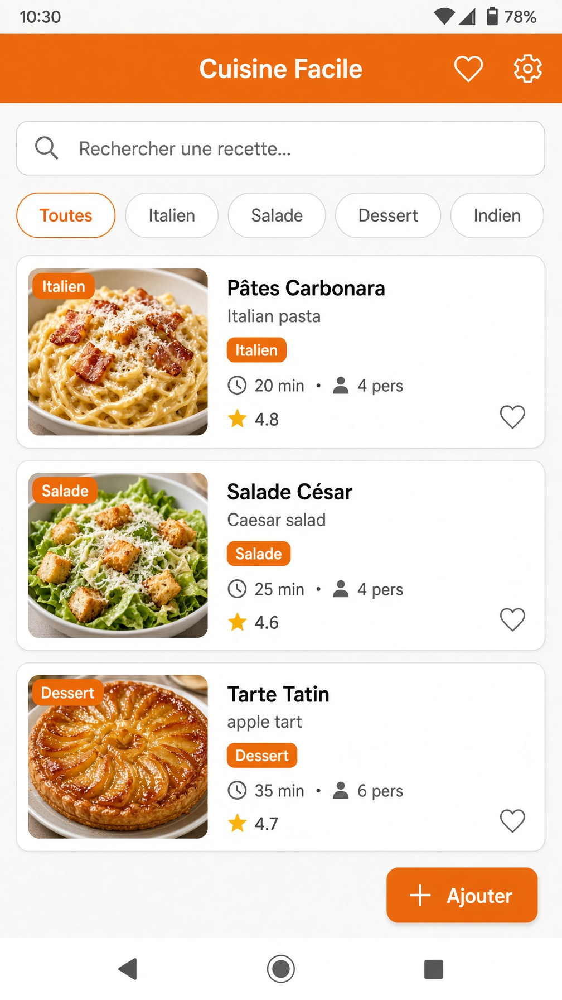
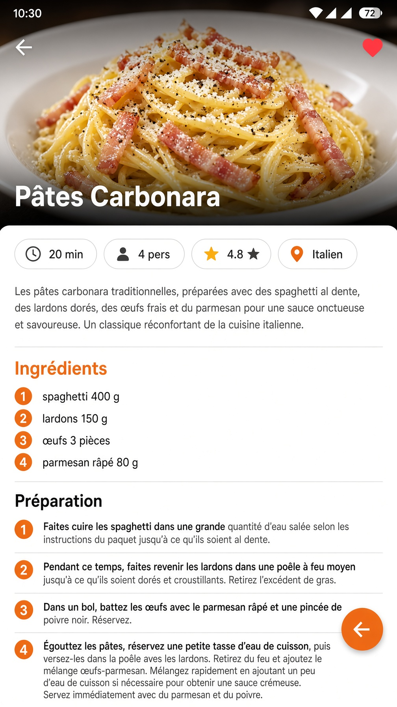
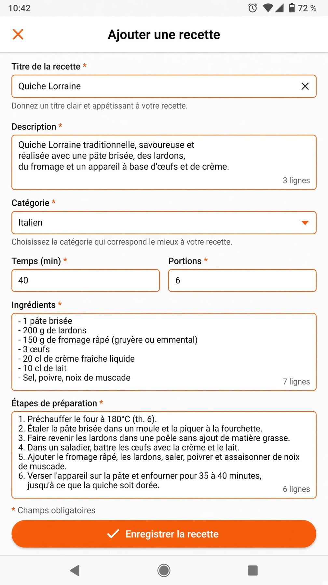
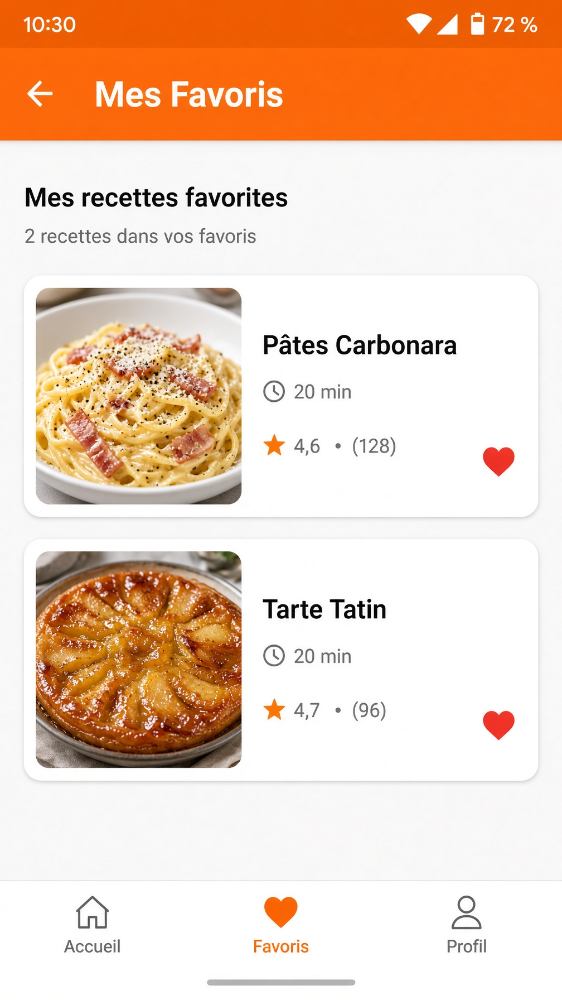
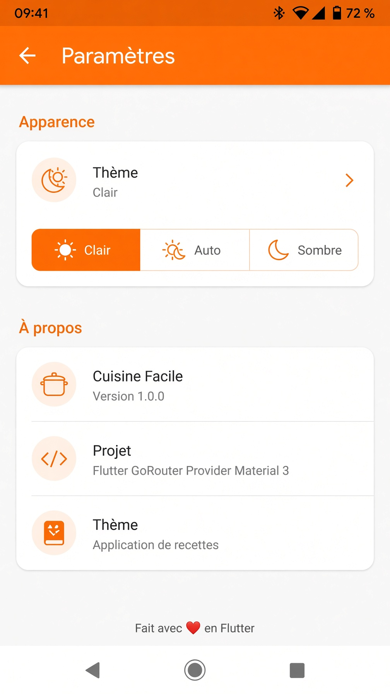

# Cuisine Facile

Application Flutter multi-écrans de recettes de cuisine, réalisée dans le cadre d'un projet de validation des compétences Flutter & Navigation.


## Fonctionnalités

| Fonctionnalité | Détail |
|---|---|
| **4+ écrans** | Accueil, Détail, Ajout, Favoris, Paramètres |
| **Navigation** | GoRouter avec routes nommées + paramètres (`/recipe/:id`) |
| **Liste + recherche** | Recherche textuelle + filtres par catégorie |
| **Écran de détail** | Passage d'id en paramètre de route |
| **Formulaire validé** | 6 champs avec validation (titre, description, catégorie, temps, portions, ingrédients, étapes) |
| **Thème clair/sombre** | Basculement + mode système, persisté avec SharedPreferences |
| **Responsive** | Layout adaptatif mobile / tablette (ListView ↔ GridView) |
| **Widgets réutilisables** | `RecipeCard`, `SearchBarWidget`, `CategoryChip`, `ResponsiveLayout` |

## Structure du projet

```
lib/
├── main.dart
├── models/
│   └── recipe.dart              # Modèle de données
├── data/
│   └── recipe_repository.dart   # Source de données (séparation UI/données)
├── screens/
│   ├── home_screen.dart         # Liste + recherche + filtres
│   ├── recipe_detail_screen.dart# Détail avec paramètres
│   ├── add_recipe_screen.dart   # Formulaire avec validation
│   ├── favorites_screen.dart    # Favoris
│   └── settings_screen.dart     # Thème clair/sombre
├── widgets/
│   ├── recipe_card.dart         # Carte réutilisable
│   ├── search_bar_widget.dart   # Barre de recherche
│   ├── category_chip.dart       # Chip de filtre
│   └── responsive_layout.dart   # Helpers responsive
├── theme/
│   ├── app_theme.dart           # Thèmes Material 3
│   └── theme_provider.dart      # Gestion du thème (Provider)
└── router/
    └── app_router.dart          # Configuration GoRouter
```

## Widgets utilisés (≥ 8)

`Scaffold`, `AppBar`, `ListView`, `GridView`, `Card`, `Stack`, `Image.network`, `TextField` / `TextFormField`, `DropdownButtonFormField`, `FilterChip`, `FloatingActionButton`, `SliverAppBar`, `CustomScrollView`, `SegmentedButton`, `CircleAvatar`, `InkWell`, `LayoutBuilder`, `MediaQuery`, etc.

## Lancement

### Prérequis
- Flutter SDK ≥ 3.0
- Dart ≥ 3.0

### Installation

```bash
# Cloner le repo
git clone https://github.com/boss-last/cuisine_facile.git
cd cuisine_facile

# Installer les dépendances
flutter pub get

# Lancer sur un émulateur / appareil
flutter run
```

### Commandes utiles

```bash
flutter analyze          # Analyse statique
flutter test             # Tests (si ajoutés)
flutter build apk        # Build Android
flutter build ios        # Build iOS
```

## Captures d'écran

| Accueil | Détail | Formulaire |
|:---:|:---:|:---:|
|  |  |  |

| Favoris | Paramètres |
|:---:|:---:|
|  |  |

## Stack technique

- **Navigation** : [go_router](https://pub.dev/packages/go_router) ^14.2
- **State management** : [provider](https://pub.dev/packages/provider) ^6.1
- **Persistance thème** : [shared_preferences](https://pub.dev/packages/shared_preferences) ^2.2
- **UI** : Material Design 3

## Checklist des exigences

- [x] ≥ 4 écrans distincts
- [x] Navigation GoRouter (routes nommées)
- [x] Écran de liste avec recherche / filtrage
- [x] Écran de détail avec passage de paramètres
- [x] Formulaire avec validation (≥ 3 champs)
- [x] Gestion thème clair / sombre
- [x] ≥ 8 widgets différents
- [x] ≥ 3 widgets réutilisables dans `widgets/`
- [x] Responsive (mobile + tablet)
- [x] Aucune donnée hardcodée dans les widgets (repository)

## Licence

MIT – libre d'utilisation pour apprentissage.
